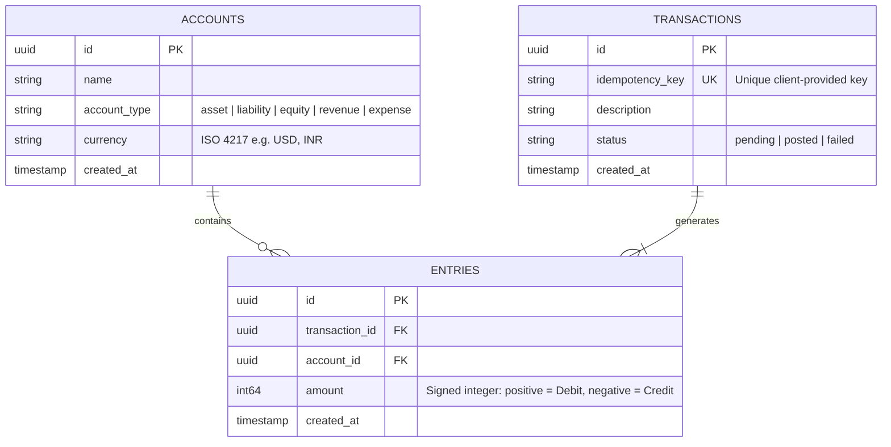
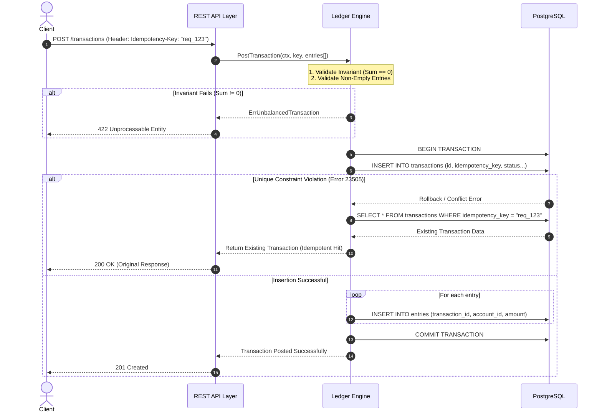

# Payment Ledger System — Architecture & System Design Document

## 1. Executive Summary & Purpose
This document defines the core architecture, data models, invariant guarantees, and engineering trade-offs for the **Payment Ledger System**. 

Unlike a standard CRUD application or a generic tutorial project, a financial ledger operates under strict consistency constraints. A single missing cent, a race condition allowing double-spending, or a floating-point rounding error can compromise the entire financial system. This system is designed from the ground up to guarantee **immutability**, **idempotency**, and **double-entry accounting correctness** under high concurrency.

---

## 2. Core Differentiators: What Makes This Stand Out?

When discussing this project in technical interviews or code reviews, these are the **five distinct architectural decisions** that differentiate this system from a naive implementation:

### 🌟 Differentiator 1: Immutable Double-Entry Accounting
* **Naive Approach**: Storing a single `balance` column on an `users` table and mutating it via `UPDATE accounts SET balance = balance - 50`.
* **Why it fails**: No audit trail. If a transaction crashes halfway or a race condition occurs, funds disappear with no way to reconstruct history or prove financial integrity.
* **Our Approach**: **Immutable Ledger Entries**. Money is never "changed"; rather, a `Transaction` creates immutable `Entries` (debits and credits). The sum of entries in every transaction must strictly equal zero ($\sum \text{entries} = 0$).

### 🌟 Differentiator 2: Database-Level Idempotency Enforcement
* **Naive Approach**: Checking application memory or running a `SELECT` query (`if db.Find(&tx, "key = ?", key) != nil`) before inserting a new transaction.
* **Why it fails**: **Time-Of-Check to Time-Of-Use (TOCTOU) race conditions**. Two identical API requests arriving within milliseconds of each other will both pass the `SELECT` check and double-charge the customer.
* **Our Approach**: Relying on database ACID guarantees via a `UNIQUE` constraint on `transactions.idempotency_key`. The Go engine catches PostgreSQL error code `23505` (unique violation) and gracefully fetches and returns the original transaction payload without executing duplicate financial logic.

### 🌟 Differentiator 3: Exact Integer Arithmetic (Minor Units)
* **Naive Approach**: Using `float64` or decimal data types for currency amounts.
* **Why it fails**: IEEE 754 binary floating-point representation bugs (`0.1 + 0.2 = 0.30000000000000004`). In financial systems, compounding rounding errors lead to balance sheet drift.
* **Our Approach**: All monetary values are represented as `int64` representing **minor units** (e.g., cents, paise). `$10.50` is stored and calculated as `1050`. Integer math is exact, blazing fast on modern CPU architectures, and immune to rounding drift.

### 🌟 Differentiator 4: On-the-Fly Derived Balances vs. Lock Contention
* **Naive Approach**: Updating a central balance table inside every transaction loop.
* **Why it fails**: High database row-lock contention (`FOR UPDATE`) serializes transactions touching popular accounts (e.g., corporate treasury accounts), degrading system throughput to near zero.
* **Our Approach**: Balances are **derived dynamically** via `SUM(amount) FROM entries WHERE account_id = X`. This trade-off prioritizes write throughput and transactional safety over read speed. For production scaling, we document the evolution path to CQRS read-models or periodic reconciliation snapshots.

### 🌟 Differentiator 5: Strict Separation of Concerns (Core Engine vs. Transport)
* **Naive Approach**: Putting database queries and business validation directly inside HTTP request handlers.
* **Why it fails**: Impossible to test ledger logic without mocking HTTP requests; cannot reuse core logic for asynchronous workers or message queues.
* **Our Approach**: A pure, isolated `internal/ledger` Go package with zero knowledge of HTTP or JSON. The REST API (`internal/api`) is merely a thin transport layer responsible for parsing headers and formatting errors.

---

## 3. Architectural Trade-Offs & Decisions Matrix

| Architectural Dimension | Decision Made | Alternative Considered | Trade-off Justification |
| :--- | :--- | :--- | :--- |
| **Balance Calculation** | **Derived on query** (`SUM(entries)`) | Stored denormalized `balance` column | **Correctness over Latency**: Eliminates lock contention and balance sync bugs. Read latency increases with history size, solved in v1.1 via snapshots. |
| **Concurrency Safety** | **DB Unique Constraints + Transactions** | App-level mutexes / Distributed locks | **Reliability**: App instances scale horizontally; memory locks fail across pods. Postgres constraints guarantee safety at the storage engine level. |
| **Currency Storage** | **`int64` minor units** | `NUMERIC(15,2)` or `float64` | **Precision & Performance**: Prevents float rounding bugs. Simplifies Go struct modeling without needing heavy arbitrary-precision math libraries. |
| **HTTP Router** | **Standard library (`net/http`) + lightweight router (`chi`)** | Heavy frameworks (`Gin`, `Fiber`) | **Control & Idiomatic Go**: Minimizes magic and bloat. Demonstrates mastery of Go's native HTTP lifecycle and middleware chaining. |
| **Error Handling** | **Domain-typed Errors** | Generic error strings / 500s | **Client Experience**: Allows mapping specific violations (`ErrUnbalanced`, `ErrDuplicateKey`) to exact HTTP status codes (`422 Unprocessable`, `409 Conflict`). |

---

## 4. Entity Relationship & Data Model

The data model consists of three core tables adhering to 3rd Normal Form (3NF):



### Double-Entry Sign Convention
To maintain simplicity and mathematical elegance in SQL queries:
* **Positive Amount (`> 0`)** = Debit
* **Negative Amount (`< 0`)** = Credit
* **Global Invariant**: For any given `transaction_id`:
  $$\sum \text{amount} = 0$$

---

## 5. System Data Flow & Request Lifecycle

### Scenario: Posting a Transaction with Idempotency Protection



---

## 6. Project Directory Architecture

```text
payment-ledger-system/
├── cmd/
│   └── server/
│       └── main.go              # Application entrypoint, dependency injection, graceful shutdown
├── internal/
│   ├── api/                     # HTTP transport layer
│   │   ├── router.go            # Route definitions and middleware registration
│   │   ├── handlers.go          # Request decoding, calling ledger engine, JSON encoding
│   │   └── middleware.go        # Idempotency header extraction, logging, error recovery
│   ├── ledger/                  # Pure business logic (Zero HTTP dependencies)
│   │   ├── engine.go            # Core service struct & interface definition
│   │   ├── post_transaction.go  # Atomic posting, balance invariants
│   │   ├── get_balance.go       # Dynamic balance aggregation
│   │   ├── get_statement.go     # Paginated account history
│   │   └── errors.go            # Domain-specific typed errors
│   └── db/                      # Database access layer
│       ├── connection.go        # Postgres connection pool setup (pgx/sqlx)
│       └── models.go            # Go struct representations of DB tables
├── migrations/                  # SQL migration files (up/down)
│   └── 000001_init_schema.up.sql
├── docs/                        # Architectural documentation & data contracts
│   ├── ARCHITECTURE_AND_DESIGN.md
│   └── data_contracts.md
├── tests/                       # End-to-end integration & concurrency invariance tests
│   ├── concurrency_test.go      # Parallel goroutines hammering idempotency keys
│   └── invariant_test.go        # Random load test proving global sum == 0
├── docker-compose.yml           # Local PostgreSQL container setup
├── go.mod
└── README.md
```

---

## 7. Next Steps & Phase 0 Execution

With this design architecture established, we proceed immediately to **Phase 0 (Project Setup)**:
1. Initialize the directory structure outlined above.
2. Configure `go mod`.
3. Create the `docker-compose.yml` for local PostgreSQL 16.
4. Establish the database connection boilerplates.
